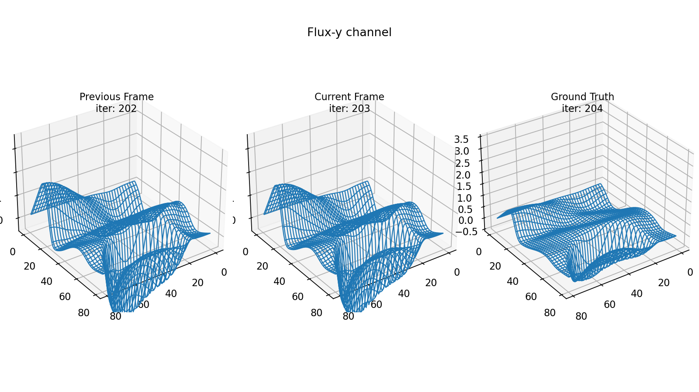

# SmartFlow

A Deep Learning solver for the Shallow Water Equations

<br />

SmartFlow is an extension of [MattFlow], which is a 2-stage [Runge-Kutta]
numerical solver for the [Shallow Water Equations] (SWE). The project comprises
the implementation of Deep Learning architectures out of the corresponding
papers. The models are trained on data produced by MattFlow, aiming to predict
the successive states of the fluid.

[SWE] is a Computational Fluid Dynamics (CFD) problem, which models the surface
of the water via a coupled system of three hyperbolic Partial Differential
Equations (PDEs).

| Requirements           |
| ---------------------- |
| python3                |
| tensorflow >= 2.2.0    |
| numpy >= 1.19.2        |
| matplotlib >= 3.3.2    |
| mattflow >= 1.3.4      |
| pandas >= 1.1.3        |
| scikit-learn >= 0.24.2 |
| scipy >= 1.5.3         |

## Contents

* [Install](#install)
* [Input - Prediction - Ground Truth](#input---prediction---ground-truth-example)
* [Dataset format](#dataset-format)
* [Dataset types](#dataset-types)
* [Preprocessing](#preprocessing)
* [Model](#model)
* [Architectures](#architectures)
* [Reference papers](#reference-papers)
* [License](#license)

## Install

```shell
pip install smartflow
```

```shell
git clone https://github.com/ThanasisMattas/smartflow.git
```

## Input - Prediction - Ground Truth example


## Dataset format

Each data example is the state of the fluid at some time-step and the
corresponding label is the state at the next time-step. A state comprises a
3D matrix, U, where the *channel* axis consists of the 3 state variables of the
SWE, surface height, flux-x and flux-y, populating the discretized 2D domain.
**The main idea is that the state matrix can be regarded as a 3-channel image,
where each pixel corresponds to a cell of the mesh and each channel to a state
variable**.

### Input data scenarios

* A single frame (one time-step)
* 2 frames (in order to give the model the opportunity to learn gradients)
* Only the surface height channel
* All 3 channels
* With/without updating boundary conditions
* Different sizes and frequency of water drops.

**The best performance occurred with 2 frames, all 3 channels, updating BC and
using the highest grid resolution, meaning that there is no redundant
information at this point.**

### Dataset Preview

30 frames every 1000 frames


## Dataset types

### [SmartFlowDS]

Base class for SmartFlow datasets

* Both NCHW and NHWC formats are supported
* Input frames have updated ghost cells, but labels don't (those cells will not
  be predicted). Therefore, after inference the prediction will be padded
  with ghost cells, before it is fed back to the model for the next prediction.
  Boundary conditions are required by the numerical scheme and can be easily
  evaluated upon inference, hopefully providing some valuable information to
  the model.
* Time-steps at which a drop fell cannot be used as labels, because there is
  no way to infer when and where a new drop will fall, using information from
  the previous state of the fluid. However, those frames can perfectly be used
  as input.
* Data [augmentation]: Random flip, rotate and shuffle of the train batch.

### [DSequence]

* Used when training on GPU or when the dataset does not fit into the memory.
* Derived from ```SmartFlowDS``` and ```keras.utils.Sequence```, in order to load one
batch at a time from a numpy memmap.

### [DSet]

* This subclass is preferred when the dataset does fit into the memory or TPUs
will be deployed on the google colab cloud.
* Derived from ```SmartFlowDs``` and ```tf.data.Dataset```.

## Preprocessing

### Normalization (mean - std)

* On-devise, using the [normalization_layer()].
* On dataset creation, using the [Normalizer] class, ​sacrificing portability in
  order to relieve the GPU while training.

### Stats type

* Per frame or batch
* Channelwise or using the whole volume

### Visualization

Checking that:

* Flip and rotation orientation of input and ground truth are coherent.
* Input dataset is shuffled.
* Examples with new-drop-frames as labels are removed, because it is not
possible to infer where and when a new drop will fall.
* Input is normalized.



## Model

### [Setup]

**loss** MeanSquaredError<br />
**metrics** MeanAbsoluteError<br />
**optimizer** Adam with learning rate scheduler<br />
**monitors** val_loss<br />
**loss_weights** [0.2, 0.8] (When multiple heads i.e. Inception_v3)

### [Callbacks]

* checkpoint
* earlystopping
* tensorboard
* learning rate schedule
* garbage collector

## Architectures

* [Inception-v3]
* [Inception-ResNet-v2]
* [Inception-ResNet-like]
* [ResNet]
* [Simple CNN]
* [Fully-Connected NN]

## Reference papers

* He, K., Zhang, X., Ren, S., Sun, J. *Deep Residual Learning for Image
  Recognition*. 2015. arXiv: [1512.03385].
* Szegedy, S., Vanhoucke, V., Ioffe, S., Shlens, J., Wojna, Z. *Rethinking the
  Inception Architecture for Computer Vision*. 2015. arXiv:[1512.00567].
* Szegedy, C., Ioffe, S., Vanhoucke, V., Alemi, A.
  *Inception-v4, Inception-ResNet and the Impact of Residual Connections on
  Learning*. 2016. arXiv: [1512.00567].
* Ioffe, S., Szegedy, C.
  *Batch Normalization: Accelerating Deep Network Training by Reducing*
  *Internal Covariate Shift*. 2015. arXiv: [1502.03167].

## License

[GNU General Public License v3.0]

<br />

>(C) 2021, Athanasios Mattas<br />
>thanasismatt@gmail.com

[//]: # "links"

<!-- Intro -->
[MattFlow]: <https://github.com/ThanasisMattas/mattflow>
[Runge-Kutta]: <https://en.wikipedia.org/wiki/Runge%E2%80%93Kutta_methods>
[Shallow Water Equations]: <https://en.wikipedia.org/wiki/Shallow_water_equations>
[SWE]: <https://github.com/ThanasisMattas/mattflow#shallow-water-equations>

<!-- Dataset -->
[SmartFlowDS]: <https://github.com/ThanasisMattas/smartflow/blob/2aabd1e3ff426ff23fa62a9011df0bc63380120a/smartflow/smartflow_pre.py#L265>
[augmentation]: <https://github.com/ThanasisMattas/smartflow/blob/198514cd843e803ce9c95ab814ff58bf6401bd9d/smartflow/smartflow_pre.py#L297>
[DSequence]: <https://github.com/ThanasisMattas/smartflow/blob/2aabd1e3ff426ff23fa62a9011df0bc63380120a/smartflow/smartflow_pre.py#L547>
[DSet]: <https://github.com/ThanasisMattas/smartflow/blob/2aabd1e3ff426ff23fa62a9011df0bc63380120a/smartflow/smartflow_pre.py#L680>

<!-- Preprocessing -->
[normalization_layer()]: <https://github.com/ThanasisMattas/smartflow/blob/2aabd1e3ff426ff23fa62a9011df0bc63380120a/smartflow/smartflow_pre.py#L84>
[Normalizer]: <https://github.com/ThanasisMattas/smartflow/blob/2aabd1e3ff426ff23fa62a9011df0bc63380120a/smartflow/smartflow_pre.py#L103>

<!-- Model -->
[Setup]: <https://github.com/ThanasisMattas/smartflow/blob/2aabd1e3ff426ff23fa62a9011df0bc63380120a/smartflow/core.py#L149>
[Callbacks]: <https://github.com/ThanasisMattas/smartflow/blob/2aabd1e3ff426ff23fa62a9011df0bc63380120a/smartflow/core.py#L67>

<!-- Architectures -->
[Inception-ResNet-v2]: <smartflow/archs/inception_resnet_v2.py>
[Inception-v3]: <smartflow/archs/inception_v3.py>
[Inception-ResNet-like]: <smartflow/archs/inception_resnet.py>
[Resnet]: <smartflow/archs/resnet.py>
[Simple CNN]: <smartflow/archs/cnn.py>
[Fully-Connected NN]: <smartflow/archs/fcnn.py>
[GNU General Public License v3.0]: <https://github.com/ThanasisMattas/mattflow/blob/master/COPYING>

<!-- References -->
[1512.03385]: <https://arxiv.org/abs/1512.03385>
[1512.00567]: <https://arxiv.org/abs/1512.00567>
[1502.03167]: <https://arxiv.org/abs/1502.03167>
[1512.00567]: <https://arxiv.org/abs/1512.00567>
